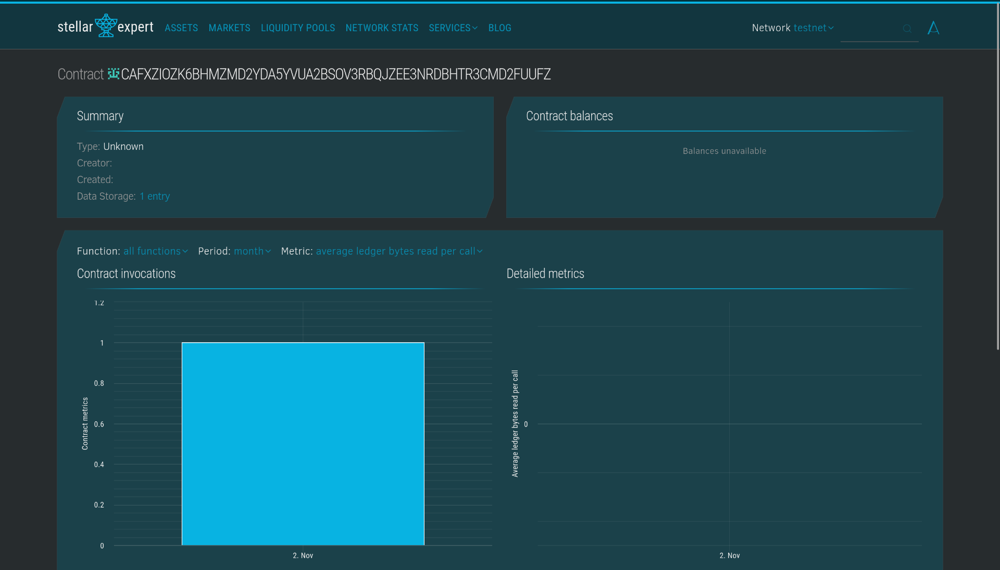

# Decentralized Online Auction Platform

## Project Title
**Decentralized Online Auction Platform**

## Project Description
A blockchain-based platform that enables transparent, secure, and trustless auctions using smart contracts to manage bids and declare winners automatically. This platform leverages the Stellar blockchain using Soroban smart contracts to ensure that all auction processes are immutable, transparent, and free from intermediary manipulation. Sellers can create auctions for their items, buyers can place competitive bids, and winners are declared automatically when the auction period ends.

## Project Vision
Our vision is to revolutionize the auction industry by eliminating centralized control and providing a truly decentralized marketplace where:
- **Transparency** is guaranteed through blockchain technology
- **Trust** is built into the system through smart contracts
- **Fairness** is ensured as all bids are publicly verifiable
- **Security** protects both buyers and sellers from fraud
- **Efficiency** is achieved through automated winner declaration and settlement

We aim to create a global auction platform accessible to anyone with an internet connection, where participants from different countries can engage in secure transactions without worrying about payment fraud, bid manipulation, or unfair practices.

## Key Features

### 1. **Create Auction**
- Sellers can create new auctions by specifying:
  - Item name/description
  - Starting bid amount
  - Auction duration (in seconds)
- Each auction receives a unique ID for easy tracking
- Seller authentication is required to prevent unauthorized auction creation

### 2. **Place Bid**
- Buyers can place bids on active auctions
- Each new bid must be higher than the current highest bid
- Bidder authentication ensures accountability
- Real-time tracking of highest bidder and bid amount
- Automatic rejection of bids lower than current highest bid

### 3. **End Auction**
- Auctions automatically conclude after the specified duration
- Winner is declared based on the highest bid
- Auction status changes to inactive after ending
- Immutable record of winner and final bid amount

### 4. **View Auction Details**
- Anyone can view complete auction information including:
  - Auction ID and item name
  - Seller address
  - Current highest bid and bidder
  - Auction end time
  - Active/inactive status
- Full transparency for all participants

### 5. **Blockchain-Powered Security**
- All transactions are recorded on the Stellar blockchain
- Immutable audit trail of all bids and auction activities
- Decentralized storage ensures no single point of failure
- Smart contract automation removes human error and bias

## Future Scope

### Short-term Enhancements
1. **Reserve Price Mechanism**
   - Allow sellers to set a minimum reserve price
   - Auction only successful if reserve price is met

2. **Bid Increment Rules**
   - Define minimum bid increment amounts
   - Prevent spam bidding with very small increments

3. **Auction Categories**
   - Organize auctions by categories (Electronics, Art, Vehicles, etc.)
   - Enhanced search and filtering capabilities

### Medium-term Developments
4. **Escrow System**
   - Automatic escrow of bid amounts during auction
   - Secure fund transfer to seller upon auction completion
   - Automatic refunds for non-winning bidders

5. **Multi-Currency Support**
   - Support for various cryptocurrencies
   - Integration with stablecoins for price stability
   - Fiat currency conversion capabilities

6. **Auction Extensions**
   - Anti-sniping mechanism with automatic time extensions
   - Extended bidding time when last-minute bids are placed

7. **Reputation System**
   - Track seller and buyer ratings
   - Build trust through transparent feedback
   - Penalize fraudulent behavior

### Long-term Vision
8. **NFT Integration**
   - Support for NFT auctions
   - Automatic transfer of digital assets to winners
   - Verification of digital asset authenticity

9. **Cross-Chain Compatibility**
   - Bridge to other blockchain networks
   - Expanded market access and liquidity

10. **Advanced Analytics Dashboard**
    - Real-time auction statistics
    - Historical price trends
    - Market insights and predictions

11. **Mobile Application**
    - Native iOS and Android apps
    - Push notifications for bid updates
    - QR code integration for quick bidding

12. **Dispute Resolution**
    - Decentralized arbitration system
    - Community-driven conflict resolution
    - Insurance mechanism for high-value auctions

13. **AI-Powered Features**
    - Automated item valuation
    - Fraud detection algorithms
    - Personalized auction recommendations

## Contract Description -
Contract ID - CAFXZIOZK6BHMZMD2YDA5YVUA2BSOV3RBQJZEE3NRDBHTR3CMD2FUUFZ

